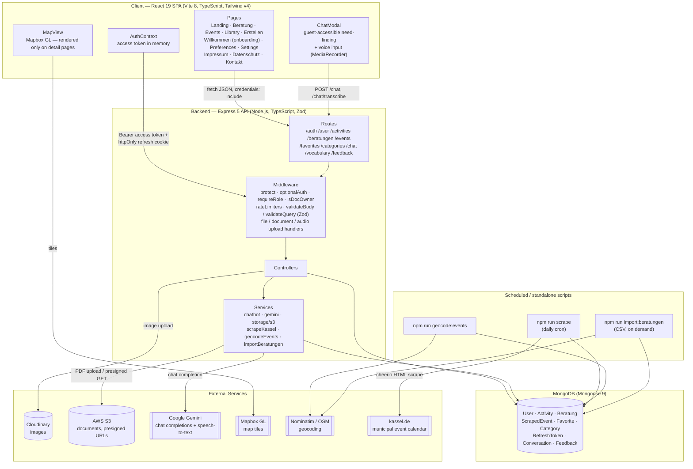
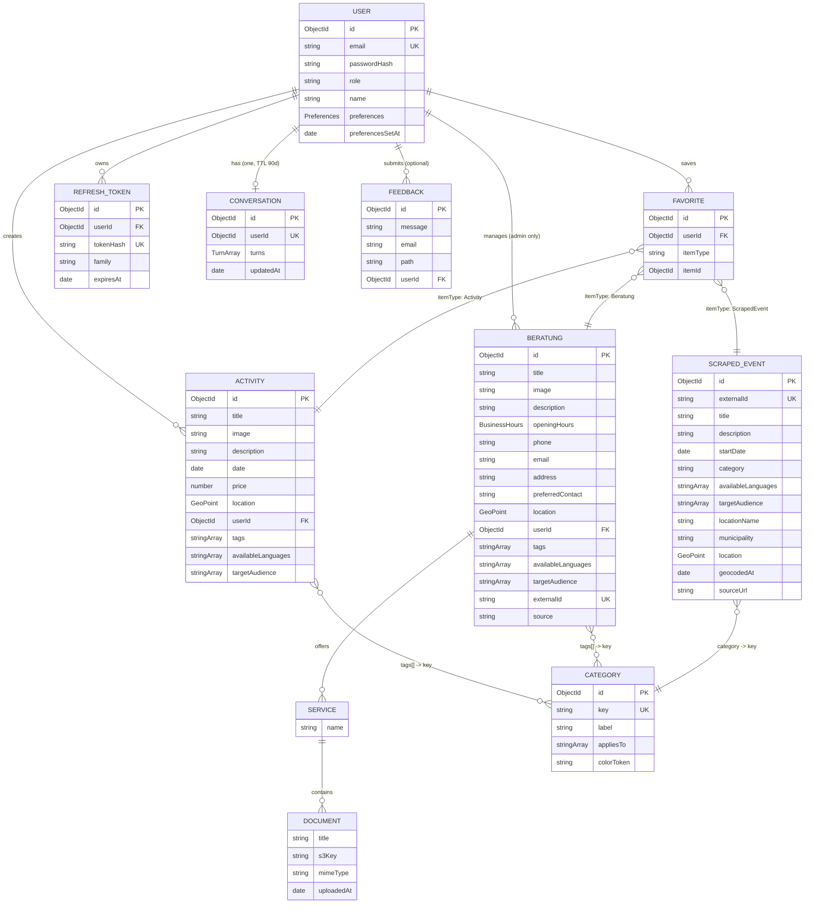
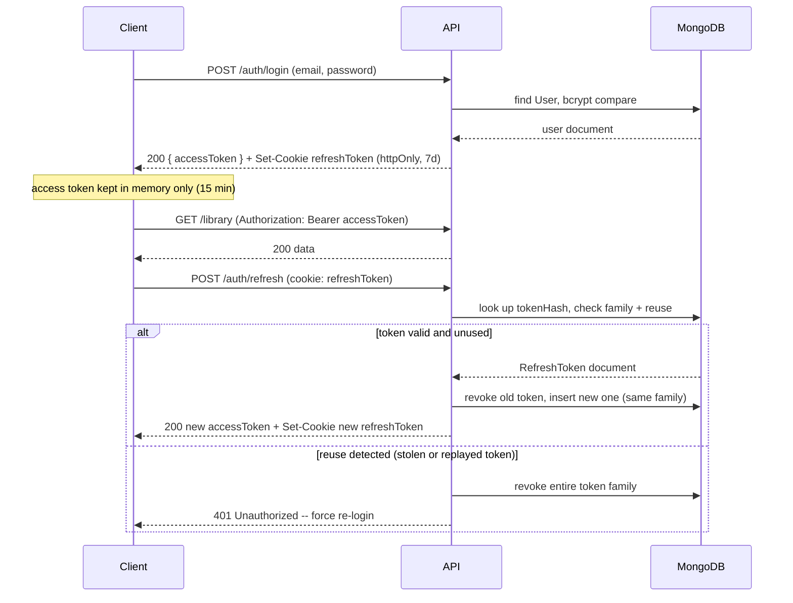

# Soko — Social Compass

_A case study of a full-stack MERN (Mongo, Express, React, TypeScript, Node) application, written in the STAR format._

Soko ("Sozialer Kompass" / social compass) is a web app that gives people in Kassel, Germany a single place to find low-cost events, activities, and counseling services (Beratungsstellen) — and to save what's relevant to them in a personal calendar. The project is built and maintained as a production-oriented MERN application: Express 5 on Node.js, MongoDB via Mongoose 9, and a React 19 + TypeScript client.

**Status:** feature-complete for the MVP scope and deployed — the whole stack runs as a Docker Compose deployment on a self-hosted box, redeployed on every push to `main` by a GitHub Actions self-hosted runner. What is still open before real users is listed in [Result](#result), not hidden.

---

## Situation

City-level information about free or low-cost family activities and social counseling services (debt counseling, addiction support, family services, asylum guidance, government offices) is scattered across dozens of municipal pages, individual organizations' websites, and PDFs. People who most need this information — families and financially disadvantaged residents — are the ones least likely to have the time or the institutional knowledge to piece it together. There was no single, low-barrier surface that combined "what's happening" (events, activities) with "who can help" (counseling providers), let alone one that let a user save both to a calendar.

## Task

Build a web application, starting with Kassel as the pilot city, that lets users discover events and counseling offers on a map and in filterable lists, save items to a personal library/calendar, and get provider details (opening hours, address, phone) without a paywall or ticketing friction. The explicit non-goals were as important as the goals: no "second Eventim" (no commerce/ticketing focus), and no cold, bureaucratic UI — the interface had to feel warm and accessible.

Beyond the product goal, the technical task was to design a data model and architecture that could absorb three very different data sources (manually created activities, a scraped municipal event calendar, and partner-submitted counseling data) into one consistent read API, without duplicating logic across content types.

## Action

### Architecture

The system is a conventional three-tier MERN architecture, with a scraping/import pipeline sitting alongside it as an offline data producer rather than a request-time dependency.



The client never talks to MongoDB, Cloudinary, S3, or Gemini directly — everything routes through the Express API, which is the single place authorization, validation, and rate limiting are enforced. The scraper, geocoder, and CSV importer are standalone Node scripts (`npm run scrape`, `npm run geocode:events`, `npm run import:beratungen`) rather than in-process schedulers, so they can fail, retry, or be re-run independently of the API's uptime.

### Data model

The data model had to represent three content types (self-created `Activity`, city-scraped `ScrapedEvent`, and admin-curated `Beratung`) that a user can browse and save interchangeably, plus a curated category taxonomy that both filters and colors all three. Rather than a shared base collection, each type stays its own Mongoose model — they don't share enough fields to justify inheritance, and keeping them separate avoids a large model with mostly-null fields. The three are unified at the API boundary instead: `GET /events` merges `Activity` and `ScrapedEvent` into one date-sorted list, and `Favorite` treats all three as bookmarkable via a polymorphic reference.



A few modeling decisions are worth calling out because they trade off simplicity against future flexibility on purpose:

**`Favorite` is one polymorphic model, not three.** It stores `itemType` (`Activity` / `ScrapedEvent` / `Beratung`) alongside `itemId`, resolved through Mongoose's `refPath`, with a compound unique index on `{ userId, itemType, itemId }`. This means the personal library and calendar (`/library`) don't need a separate `Appointment` model — a saved item with a date _is_ the calendar entry. A dedicated `Appointment` model is deferred until users need to create free-standing appointments that aren't tied to a discoverable item.

**`Category` is a whitelist, not a foreign key.** `Activity.tags` and `Beratung.tags` remain plain `string[]`, but every value must exist in `Category.key` — checked server-side on every write. This was chosen over `ObjectId` references so that filtering (`?tags=finanzen`) stays a simple `$in` query without `populate()` calls in every controller, while still getting centralized, typo-proof category management. The taxonomy currently has 11 keys (e.g., `familie`, `finanzen`, `gesundheit`, `sport`, `bildung`), each tagged with which content type(s) it applies to (`appliesTo: ["activity", "beratung"]`) and a design-token color for consistent UI treatment.

**Geospatial data is a first-class field, not an afterthought.** `Activity` and `Beratung` both require a GeoJSON `Point` with a `2dsphere` index at creation time. `ScrapedEvent` is the exception: the city's calendar only provides a location _name_ as text, so `location` is optional there and gets backfilled asynchronously by a geocoding script against Nominatim (OpenStreetMap), which also stamps `geocodedAt` on every attempt — including failed ones — so repeated runs don't re-query locations that are known to be unresolvable.

**Nested data stays embedded until reuse demands otherwise.** `Beratung.services` is a subdocument array (`{ name, documents: [...] }`) that groups application forms by use case (e.g., Jobcenter → Grundsicherung → application PDF), mirroring the existing `openingHours` embedding pattern. It only gets promoted to its own collection if the same document needs to be referenced from multiple counseling centers (e.g., a nationwide form) — until then, embedding avoids joins for a read-heavy detail page.

**Language and audience are constants, not a second `Category` collection.** Two more filter axes were added after the first build — `availableLanguages` (does anyone here speak Arabic, Ukrainian, Farsi?) and `targetAudience` (single parents, refugees, seniors, people with disabilities) — on all three content types. They deliberately did _not_ become a collection like `Category`: they have no color, no `appliesTo`, no admin surface, and they do not grow, so a collection would have meant a seed script and a migration for nothing. They live as frozen lists in `utils/filterVocabulary.ts`, are validated on write with the same 400-with-plain-reason pattern as categories, and are served to the client at `GET /vocabulary` so labels exist in exactly one place. An **empty array means "no information given" and therefore matches every filter** — the alternative would hide every legacy and scraped record the moment a user picks a language.

**Chat history is one document per user, and it expires by itself.** `Conversation` holds up to 20 turns for a signed-in user, with no threading and no guest records: pinning text about debt, addiction, or asylum status to an anonymous session cookie is exactly the identification the chat is designed to avoid. A Mongo TTL index on `updatedAt` deletes a conversation 90 days after its last turn, so retention is a property of the schema rather than a cleanup job someone has to remember.

**Feedback is write-only on purpose.** `POST /feedback` (rate-limited to 5 per 15 minutes, reachable from the footer on every page) is the whole API — no read endpoint, no delete, no admin status workflow. `userId` comes only from `optionalAuth`, never from the request body, and `email` stays optional so anonymous feedback remains possible. It is read via `mongosh` until an analytics surface exists.

### Authentication and authorization

Auth is a short-lived JWT access token (15 minutes, kept in memory on the client — never in `localStorage`) paired with a rotating, httpOnly refresh-token cookie (7 days). Each refresh token belongs to a "family"; if a token is replayed after it's already been rotated, the entire family is revoked, which is a standard defense against a stolen refresh token being reused after the legitimate client has already moved on to the next one in the chain.



Passwords are hashed with bcrypt at cost factor 12. Authorization is role-based (`user` / `creator` / `admin`) via a `requireRole(...roles)` middleware factory, combined with a generic `isDocOwner(Model)` check for owner-or-admin mutation rules. Counseling-center data (`Beratung`) is deliberately restricted to `adminOnly` writes rather than the more permissive `creator` role used for `Activity` — a quality-control decision, since incorrect information about a debt counselor or an asylum service is a materially different risk than a wrong event listing.

### Data ingestion

Three independent pipelines feed the same read surface:

| Pipeline           | Source                                 | Mechanism                                                            | Frequency                                |
| ------------------ | -------------------------------------- | -------------------------------------------------------------------- | ---------------------------------------- |
| Municipal scraper  | `kassel.de/veranstaltungskalender.php` | `fetch` + `cheerio`, idempotent upsert on `externalId`               | Daily cron                               |
| Geocoding backfill | Nominatim (OpenStreetMap)              | 1 request/sec, dedup'd by venue name, skips already-attempted venues | Runs after every scrape, plus standalone |
| Partner import     | Counseling-org CSV                     | Custom parser (no CSV dependency), upsert on `Beratung.externalId`   | On demand, per partnership               |

The scraper normalizes the city's raw category labels (e.g., "Sport / Freizeit" → `sport`) through a single mapping table (`utils/categoryMapping.ts`) that both the scraper and a one-time migration script share, so there's exactly one place that knows how external vocabulary maps to the internal taxonomy. Unmapped categories fall into a visible `sonstiges` ("other") bucket rather than being silently dropped, and get reported on every run — currently around 174 of roughly 3,180 scraped events. Because everything upserts on `externalId`, adding a new mapping rule retroactively fixes historical data on the next scheduled run, with no backfill script required.

### AI-assisted need-finding

A chatbot (`POST /chat`) helps users articulate a need in plain language and get pointed at the right counseling office or event — deliberately available to guests, since asking for help is often the point at which someone is least willing to create an account. It runs in the existing API process rather than a separate service, with its own stricter rate limit (40 requests / 15 minutes) given the per-call cost of the underlying model.

The response contract (`ChatReply`) makes its guardrails structurally mandatory rather than optional fields a future change could accidentally drop: every reply carries a `handoff` (a concrete human next step — book an appointment, call, visit), a `disclaimer` is required whenever the topic touches finance, asylum, or health, and an `urgent` field carries crisis hotlines. A `knownOnly()` filter discards any ID the model returns that doesn't exist in the actual dataset, which structurally rules out hallucinated recommendations. Since the chat now draws from two pools — `Beratung` and `ScrapedEvent`, so "I'm lonely" can surface a meetup and not only a counseling office — candidates are keyed by `itemType:id` rather than ID alone, because an ID is not unique across collections. If no API key is configured, or the model call fails or times out, the app falls back to a deterministic keyword-to-category lookup table — degraded, but never silent. The fallback covers counseling only: without a model, the counseling referral is the function that matters, and events would need a second keyword table to earn their place.

Three things were added to the chat after the first version, each with a privacy constraint attached:

- **Follow-up questions.** Recent turns are sent back to the model so a second message narrows the previous selection instead of restarting. For signed-in users the history is persisted (see `Conversation` above); guests keep theirs in the browser tab only.
- **Preference-aware answers.** If the user has set preferences, a single context line ("looking for offers in Arabic, for families") is added to the prompt. It carries **only filter keys** from the closed vocabulary — never free text, never anything the user typed elsewhere.
- **Voice input.** `POST /chat/transcribe` takes a `MediaRecorder` blob and returns a **verbatim** transcript plus the detected language; the text lands in the input field so the user can check it before sending. Not translated, on purpose: a German translation is exactly what the person the feature exists for could not verify. The upload is capped at 10 MB, the MIME allowlist is checked before the bytes reach the model, and the temp file is unlinked in a `finally`. Browsers label these recordings `audio/webm` (Chrome) or `audio/mp4` (Safari), both of which the API rejects while accepting the identical bytes under `audio/opus` / `audio/m4a` — a one-table remap that a WAV test file will never reveal is missing.

### Onboarding, preferences, and filtering

New accounts land on a skippable onboarding wizard (`/willkommen`, rendered without the sidebar so nothing competes with it) that asks for languages, audiences, topics, and a "free offers only" toggle. `preferencesSetAt` is stamped **even when the user skips**, so "decided not to answer" is distinguishable from "hasn't been asked" and nobody sees the wizard twice. The same picker component is reused on `/preferences` under settings — one component, two entry points.

Preferences feed the same query vocabulary the filters use, and all filter logic lives in one `buildFilter` helper on the server plus one `SearchFilter` component and `useFilters` hook on the client, rather than being re-implemented per page. Free-text search escapes regex metacharacters before building the query — a user typing `(` should get no results, not a 500.

### Legal pages, accessibility, and hardening

The footer is always reachable (it used to be hidden on mobile) and links `/impressum`, `/datenschutz`, and `/kontakt` — required by German law for a public site, and useless if only desktop users can find them. A dedicated `PasswordField` component gives every password input a proper show/hide control and the right `autocomplete` tokens, and the color system was audited against contrast requirements with a small `npm run contrast` script rather than by eye.

Three fixes from a security review are worth naming because each was silent in normal use:

- `trust proxy` combined with a per-IP rate limiter behind the reverse proxy meant every user shared one bucket — one active visitor could rate-limit everybody. It looked fine until there was more than one user.
- `formidable` temp files were never unlinked on the error path, slowly filling the container's disk.
- The client's error handling collapsed distinct API failures into one ambiguous message, so real 4xx reasons never reached the user.

### Deployment

The stack ships as three containers behind one Compose file: `mongo`, a multi-stage `node:26-alpine` build for the API, and the client built with Vite and served by nginx, which also proxies `/api/` to the backend so the SPA speaks to a same-origin relative path and no `VITE_API_URL` needs to exist per environment. Two deliberate bindings: Mongo publishes **no** port at all (it runs without authentication, so a published port would be open read access to counseling data, favorites, and chat history for anyone on the network — admin access goes through `docker compose exec mongo mongosh`), and the client binds to `127.0.0.1:8080` rather than `0.0.0.0`, so reaching it requires the reverse proxy, not merely being on the same LAN.

Deployment is a push to `main`: a GitHub Actions job on a self-hosted runner checks out, copies the `.env` from outside the workspace (checkout runs `git clean -ffdx`, which would otherwise delete it), runs `docker compose up -d --build`, and prunes dangling images. Secrets are never in the repo — which also means a `git pull` on the server never brings new ones, and the file has to be maintained there separately.

### Tech stack

| Layer          | Technology                                                                                      |
| -------------- | ----------------------------------------------------------------------------------------------- |
| Client         | React 19, TypeScript, Vite 8, React Router 8, Tailwind CSS v4, React Hook Form + Zod, Mapbox GL |
| Backend        | Node.js, Express 5, TypeScript, Zod 4                                                           |
| Database       | MongoDB, Mongoose 9 (`2dsphere` geo indexes)                                                    |
| Auth           | JWT (access + rotating refresh), bcryptjs                                                       |
| Storage        | Cloudinary (images), AWS S3 (documents, via presigned URLs)                                     |
| AI             | Google Gemini (`@google/genai`) — chat + speech-to-text, with deterministic fallback            |
| Data ingestion | Cheerio (scraping), Nominatim/OSM (geocoding)                                                   |
| Testing        | Node's built-in test runner (no external framework) — 68 backend + 12 client tests              |
| Deployment     | Docker Compose (Mongo · Node API · nginx-served SPA), GitHub Actions on a self-hosted runner    |

## Result

The application is functionally complete end to end for its MVP scope **and deployed**: the full stack runs under Docker Compose on a self-hosted server, redeployed automatically on every push to `main`. Users can browse activities, city events, and counseling services on a map and in lists filtered by category, language, audience, and price; save any of them to a personal library that doubles as a calendar; sign up, log in, pick preferences in a skippable onboarding wizard, switch themes, and (with the `creator` role) publish their own activities; and get admin-curated counseling-center details including opening hours, contact channels with a preferred one, and downloadable application documents. The chatbot gives guests a conversational entry point into both counseling and event data — by voice as well as by text, in the language they speak — with hard guardrails against fabricated recommendations, and remembers the conversation for signed-in users for 90 days. Feedback can be sent from the footer of any page.

The test suite is 80 tests across both packages on Node's built-in runner, all passing, and covers the parts where a silent regression would be expensive: filter composition, category mapping, the closed vocabularies, chat guardrails, import and scrape parsing, upload handling, and calendar math.

On the data side, the pipeline is live: the scraper runs daily against Kassel's municipal calendar, geocoding resolves roughly 60% of scraped venues automatically (the remainder are venue names too ambiguous for Nominatim to resolve, e.g., "Schülerforschungszentrum Nordhessen" — a known limitation that needs better search fallbacks, not more code), and the CSV partner-import path is documented (`docs/PARTNER-IMPORT.md`) for onboarding real counseling organizations without scraping their sites.

A few things are explicitly not production-ready yet, and are tracked rather than hidden:

- **Gemini runs on the free tier**, which is not appropriate for real users given that conversations may touch debt, addiction, or asylum status (GDPR Art. 9 special-category data) — billing has to be enabled and the privacy policy updated before launch.
- **The privacy policy is still a draft** pending legal review, as is the Impressum content.
- **Feedback has no delivery path.** Submissions land in MongoDB and are read with `mongosh`; no email service is hooked up and there is no admin view.
- **No centralized environment-variable validation.** `config/` still only exports the DB connection, so a missing S3 or Gemini credential surfaces at first upload rather than at startup — the kind of failure that is cheap to prevent and annoying to diagnose.
- **MongoDB runs without authentication**, which is survivable only because the port is unpublished and the host is not exposed. It needs credentials before anything else lands on that box.

These are known, scoped gaps rather than surprises, which was the point of maintaining `PROJEKT.md` and `ARCHITEKTUR.md` as living documents throughout the build.

---

## Repository layout

```
soko/
├── docker-compose.yml    mongo · backend · nginx-served client
├── .github/workflows/    deploy on push to main (self-hosted runner)
├── soko-backend/         Express API, Mongoose models, scripts (scrape/geocode/import/seed)
└── soko-client/          React SPA (Vite)
```

Both packages run their tests with `npm test` (Node's built-in runner, no framework). Backend one-off jobs are npm scripts: `scrape`, `geocode:events`, `import:beratungen`, `seed:categories`, `seed:activities`, `seed:events`, plus the migrations (`migrate:tags`, `migrate:favorites`, `backfill:audiences`).

The root `.env` next to `docker-compose.yml` is the only one Compose passes into the containers; `soko-backend/.env` is for local `npm run dev` only.

### Context documents

The project is developed alongside a set of working documents kept **outside this repository**, one directory up, so that planning notes and session logs stay out of the published history: `PROJEKT.md` (roadmap and current status), `ARCHITEKTUR.md` (design rationale behind the data model), `UMSETZUNG.md` (per-phase implementation playbook for open work), `KONVENTIONEN.md` (coding conventions), `SESSIONS.md` (work log), `Design.md` (design system/tokens), and `docs/PARTNER-IMPORT.md` (CSV format for counseling-org partners).

They are referenced throughout this README for provenance; they are not part of the clone.
